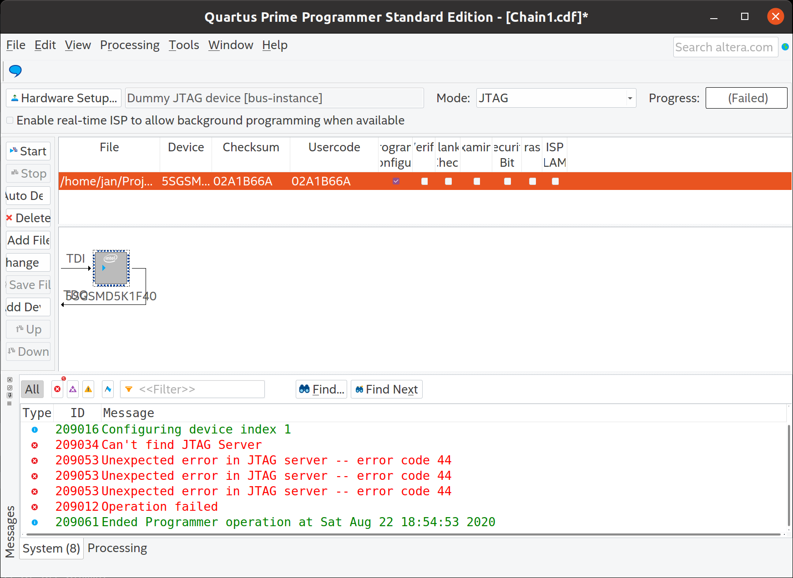

# JTAG library for FT232H on OCS Tray Mezzanine Adapter

## Current state

- JTAG scan chain works
- Programming the FPGA does not work
- Smaller improvements also pending



## Useful links

  * https://forums.intel.com/s/question/0D50P00003yyL2bSAE/bemicro-and-programming-under-linux

## Dummy device

To install the library:

```
sudo ln -sf $(readlink -f libjtag_hw_dummy.so) /opt/intelFPGA/19.1/quartus/linux64/
```

To listen do the debug log:

```
nc -lkuU /var/tmp/jtag-dummy.sock
```