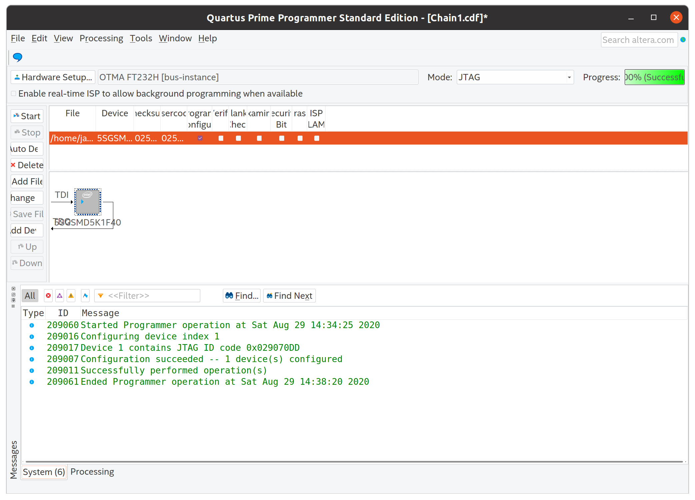

# JTAG library for FT232H on Pikes Peak / Storey Peak FPGA Boards

This driver allows using the on-board FT232 chip as a JTAG interface in Quartus for the Pikes Peak and Storey Peak FPGA accelerator boards.

## Installation

Install pre-reqs:

```sh
# On Debian/Ubuntu hosts
sudo apt-get install -y libtool pkg-config texinfo libusb-dev libusb-1.0.0-dev libftdi-dev autoconf libjim-dev git wget build-essential cmake
```

Build:

```sh
git clone https://github.com/j-marjanovic/jtag-quartus-ft232h
cd jtag-quartus-ft232h
mkdir build && cd build
cmake ..
make -j`nproc`
```

To install, copy `libjtag_hw_otma.so` to your quartus `linux64` directory (eg. `$HOME/altera/15.0/quartus/linux64`).

To avoid permission errors, create an UDev rule allowing permission to the `plugdev` group and add your user to this group.

```sh
cat << EOF | sudo tee /etc/udev/rules.d/100-usb-ftdi.rules
SUBSYSTEM=="usb", ATTRS{idVendor}=="0403", ATTRS{idProduct}=="6014", OWNER="root", GROUP="plugdev", TAG+="uaccess"
EOF
```

Add your user to `plugdev` group with `sudo adduser $USER plugdev`

## Initialization

Before using this driver, run OpenOCD to initialize the FT232H:

```sh
openocd \
    -f interface/ftdi/um232h.cfg \
    -c "adapter_khz 2000; transport select jtag; jtag newtap auto0 tap -irlen 10 -expected-id 0x029070dd; init; exit;"
```

To initialize the interface at different clock speeds, change the `adapter_khz` parameter.


OpenOCD prebuilt binaries can be downloaded from <https://github.com/xpack-dev-tools/openocd-xpack/releases>.

## Current state

- JTAG scan chain and programming of the FPGA works (see the screenshot below)
- Initialization of the MPSSE is not implemented --> run OpenOCD once to init the device
- Smaller improvements also pending

### Download time

The following table present the bitstream download time at different clock
speeds for 5SGSMD5 with the bitstream size of 213,798,880 bits (cca 26 MB).

| Clock rate [MHz] | Download time [mm:ss] |
|------------------|-----------------------|
|  2               | 03:51                 |
|  4               | 02:50                 |
|  6               | 02:24                 |
| 10               | 02:03                 |
| 20               | 01:54                 |


### Usage example

Result after programming the bitstream:



## Useful links

  * https://forums.intel.com/s/question/0D50P00003yyL2bSAE/bemicro-and-programming-under-linux ([archive.today link](http://archive.today/1iEwQ))
  * https://community.intel.com/t5/Programmable-Devices/MAX10-JTAG-Instruction-Set-Understanding-what-USBBlaster-is/td-p/218784 ([archive.today link](http://archive.today/J0Cc2))

## Dummy device

To install the library:

```sh
sudo ln -sf $(readlink -f libjtag_hw_dummy.so) /opt/intelFPGA/19.1/quartus/linux64/
```

To listen do the debug log:

```sh
nc -lkuU /var/tmp/jtag-dummy.sock
```
